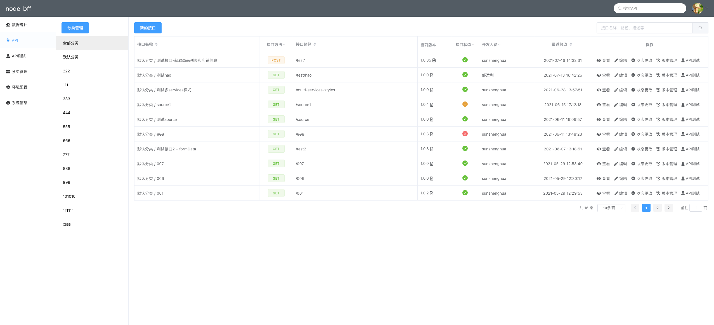
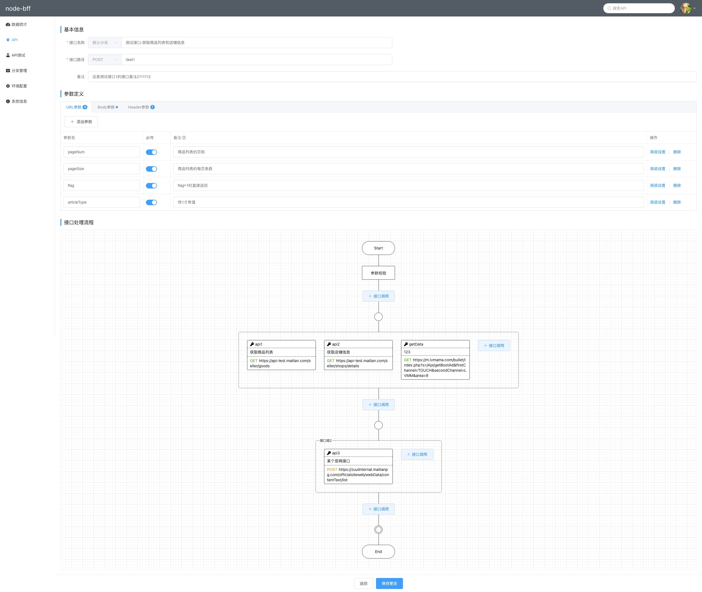
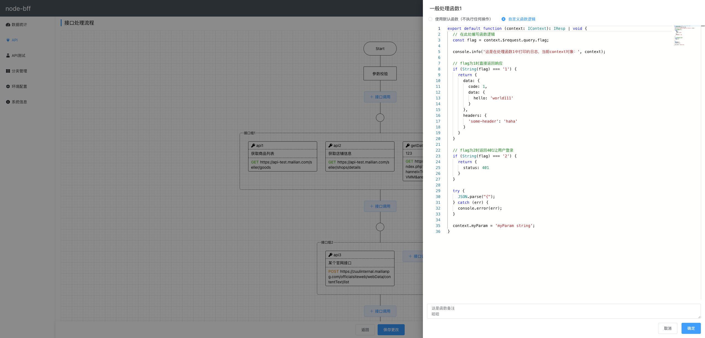
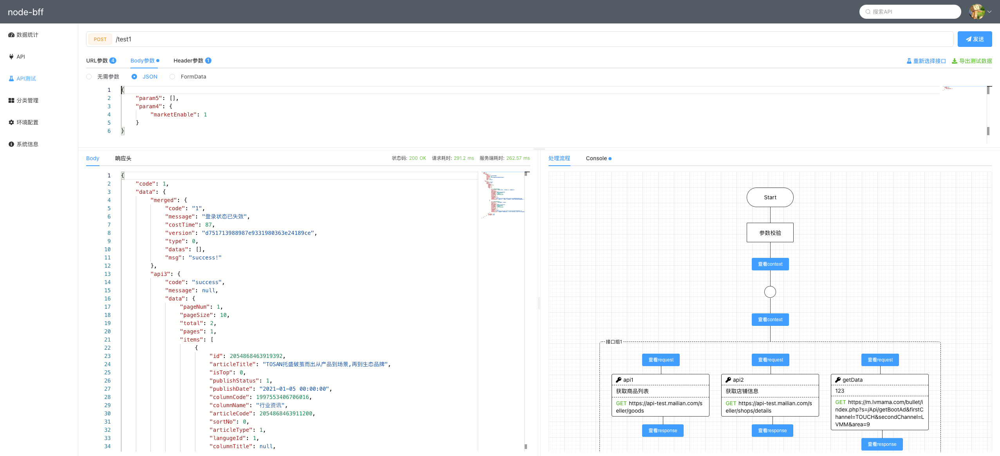
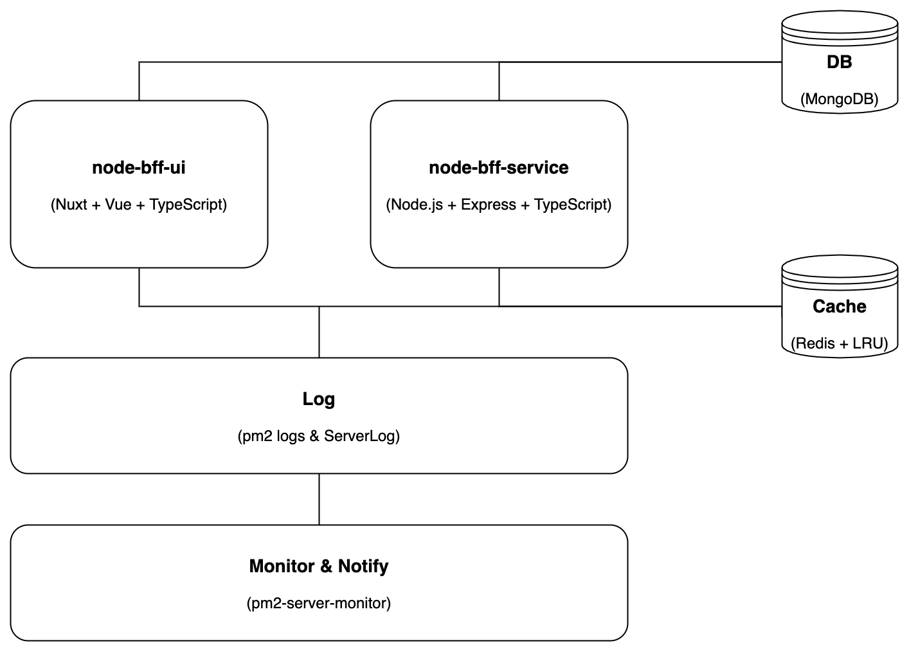
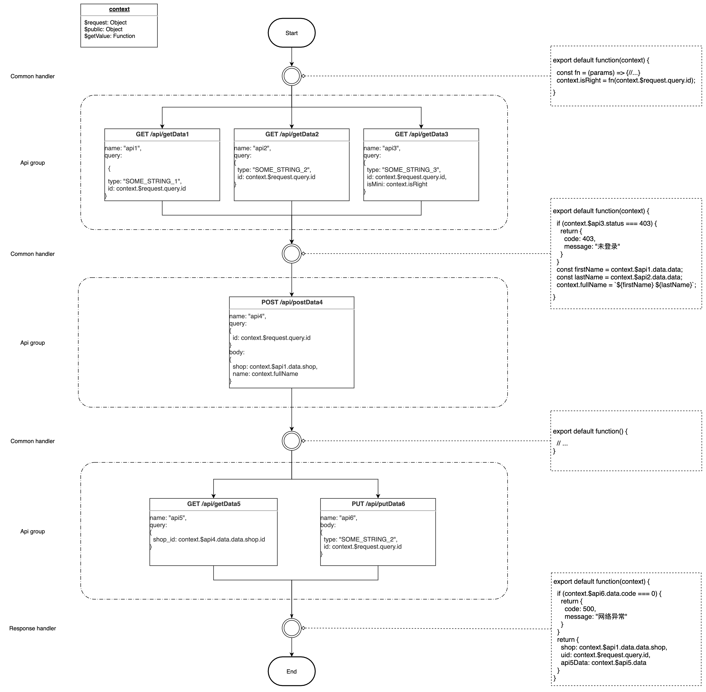
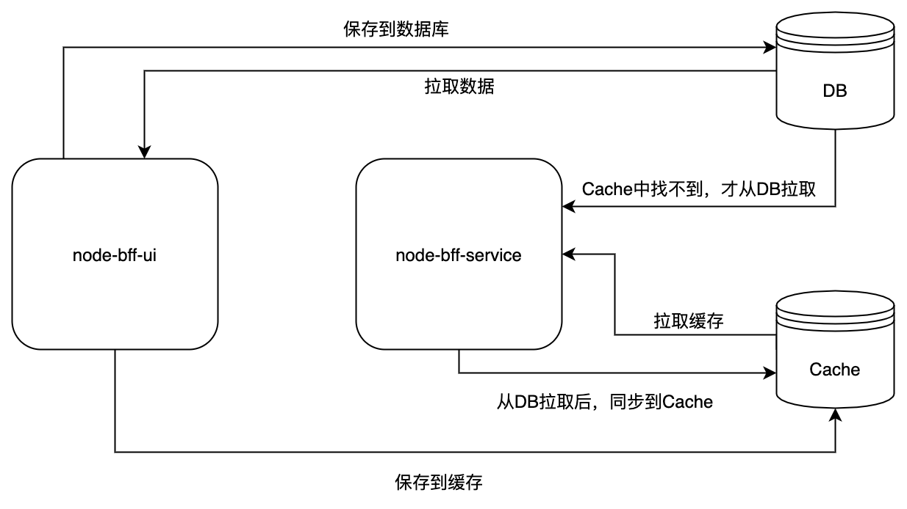

# node-bff
基于 Node.js 的可视化 BFF 解决方案。

> BFF —— Backend for frontend，即服务于前端的后端。  
> 简单来说，BFF就是在传统的前端和基础服务（接口）之间，增加一个适配层，以更好的满足前端的需求。

要快速开始，请进入 `node-bff-ui` 和 `node-bff-service` 目录参照说明安装及启动项目。

### 预览
* 接口列表

* 接口详情

* handler函数编辑

* 接口在线调试


### 系统概述

- 支持通过可视化、配置化方式，拼装聚合接口，聚合接口底层再去调用基础接口或第三方API。
- 可视化指的是以类似流程图的形式展示一个聚合接口的完整的处理流程，清晰直观。
- 配置化指的是以无代码或低代码实现一个聚合接口。
- 对于不需要做额外逻辑处理的情形，能够在数分钟内以纯配置方式拼装一个聚合接口，而无需编写任何代码。
- 对于需要做一些额外逻辑处理的情形，在各个阶段会自动插入函数，提供编写代码进行业务逻辑处理或参数处理的能力。
- 对于需要在额外逻辑处理中编写复杂代码的情形，例如需要引入第三方库、需要自定义接口响应头等，该系统不支持，只能和之前的接口组类似，在项目中手动开发一个接口。

### 相关解释

**context**：该聚合接口的上下文对象，会作为参数传入所有处理函数中，在定义基础接口的入参时也可以访问到。初始的 context 对象包含了3个字段：
  - `$request` - 请求对象，包括 query, body, cookies, headers 等
  - `$public` - 配置的公共参数
  - `$getValue` - 安全地获取字段值的方法

**聚合接口**：在本系统中创建的接口，可以配置内部调用的基础接口，也可以编写任意处理函数。

**基础接口**：后端提供的基于微服务的具备单一职责的接口，在添加一个基础接口到接口组时，必须指定 name，后续流程可以通过 `context.${name}` 获取到该接口的响应对象。

**API group**：包含1个或多个基础接口，并发调用。只有当接口组中的全部接口都请求完成后，流程才会继续。

**Handler**：处理函数，会在聚合接口的各个阶段自动执行，可以用来编写业务逻辑代码、构建后续接口组需要的参数、直接返回响应等。

**Common handler**：位于 Start 之后或相邻两个 API group 之间的处理函数。默认处理函数内容为空，即不执行任何操作。

**Response handler**：聚合接口结束之前的处理函数，可以在这里组装最终响应结果。必须要有返回值。默认处理函数会返回流程中所有基础接口的聚合响应内容。

### 总体设计

- 技术架构


- node-bff-ui

这是一个 Web 应用，使用禅道（或Gitlab）账号登录系统，可配置哪些账号具有编辑权限，类似 Node Proxy。大概的功能模块包括：
  1. 查看聚合接口列表
  2. 新增或编辑聚合接口
  3. 查看基础接口列表
  4. 新增或编辑基础接口
  5. 查看公共参数列表
  6. 新增或编辑公共参数
  7. 全局配置项管理

创建一个新的聚合接口的大概流程如下：
  1. 点击新增聚合接口，输入接口路径和入参，保存后跳转到编辑页；
  2. 初始状态，流程中只包含 Start、1 个 Common handler、Response handler、End 节点；
  3. 可以在新的或当前的 API group 中，通过点击新增基础接口按钮，添加基础接口；
  4. 添加基础接口时可以自行输入接口路径，也支持通过联想从基础接口库中自动读取；
  5. 基础接口的入参可以配置为一个表达式；
  6. 基础接口可以单独配置超时时长；
  7. 基础接口可以单独配置异常（500、超时等）处理方式，是忽略异常还是终止流程；
  8. 基础接口可以单独配置未登录处理方式，是忽略未登录还是终止流程；
  9. Start 之后、End 之前、相邻 API group 之间会自动生成处理函数，可以通过在线编写处理函数来添加复杂功能，详见处理函数说明；
  10. 处理函数代码字符串会保存到数据库中。
  11. 点击保存，将聚合函数的入参等请求信息、流程中的处理函数和 API Group 序列化为一个 JSON 字符串保存到数据库。大致的数据结构类似这样：
```json
[
    "export default function() {//...}",
    [
        {"url": "/api/getData1", "method": "get", "params": "a=1&b=2"},
        {"url": "/api/getData2", "method": "get", "params": "a=1&b=2"}
    ],
    "export default function() {//...}",
    [
        {"url": "/api/getData1", "method": "get", "params": "a=1&b=2"}
    ],
    "export default function() {//...}"
]
```
- node-bff-service

这是一个服务端应用，可以手动开发聚合接口，也可以根据 node-bff-ui 配置的聚合接口规则，自动返回响应。
处理流程如下：
  1. 服务器接收到聚合接口的请求；
  2. 如果请求命中了手动开发的接口路由，则进入该路由进行处理；
  3. 否则，看 API Factory UI 配置的聚合接口列表中是否能匹配到该请求，匹配到则执行下一步，还是匹配不到则触发异常处理；
  4. 解析匹配到的聚合接口 JSON（如上代码块），应该是一个数组，依次执行每个元素；
  5. 如果当前元素是 handler，则调用 handler 并传入 context，若有返回值则终止响应，若没有返回值则继续执行下个元素；
  6. 如果当前元素是 API group，首先计算入参部分的表达式，然后调用 axios 发起请求。当请求出现异常时会触发异常处理；
  7. 数组各项执行完毕，进行最终的数据处理，返回响应。
   
### 处理函数说明
- 代码必须是一个模块，必须要有默认导出。
- 默认导出要是一个函数。
- 函数总是接收一个入参 `context`，可以通过 `context.$request` 获取请求对象，通过 `context.${apiName}` 获取某个基础接口的响应，也可以通过 `context.xxx` 添加新的数据供后续流程访问。
- 如果函数没有返回值（即返回值为 undefined），则执行完函数后继续往下走。
- 如果函数有返回值，则将该值作为聚合函数的响应内容，并终止后续流程。
- 函数的返回值必须符合 `{code: Number, data: any}` 格式，否则触发异常处理。
- 
- 函数可以访问 `context`、当前作用域的局部变量和相关全局变量，但无法访问浏览器特定的全局变量如 `window`，也无法引入模块。
- 不建议在代码中访问 Node.js 特定的全局变量，因为这不利于在浏览器端对聚合接口及单个的处理函数进行在线调试、单元测试等。
### 处理流程示意图


### 版本管理及回退
每次创建或编辑聚合接口，都会在数据库中创建一条新的接口数据，称为一个版本。
版本之间可以方便地比较差异。
调用聚合接口时，默认会调用当前版本，也可以传入如 v1.1.0 调用指定版本的接口。
支持回退到任意版本，即将指定版本设置为当前版本。
  7. 异常处理
    1. 如果找不到聚合接口，返回响应 {code: 404, message: "服务不存在", debugMsg: ""}。
    2. 如果命中了聚合接口，不论接口执行过程中是否出现异常，聚合接口最终总是返回一个JSON。
    3. 出现服务端代码执行出错或 handler 执行出错（如值不存在），聚合接口返回响应 {code: 500, message: "内部服务器错误", debugMsg: "xxx is undefined"}。
    4. 处理函数有返回值但数据结构不符合规定（如 {code: Number, data: any}），会终止后续流程，聚合接口返回响应 {code: 500, message: "内部服务器错误", debugMsg: "数据结构错误"}。
    5. 当基础接口身份验证不通过，由流程图构建时该基础接口的设置决定如何处理异常。若设置为忽略异常，则即使接口报错也继续后续流程，可以在后续处理函数中自行处理；若设置为验证失败终止执行，则自动终止流程，并返回响应 {code: 403, message: "禁止访问", debugMsg: ""}。
    6. 除身份验证外的基础接口调用异常（如响应码500或接口超时等），由流程图构建时该基础接口的设置决定如何处理异常。若设置为忽略接口异常，则即使接口报错也继续后续流程，可以在后续处理函数中自行处理；若设置为接口异常终止执行，则聚合接口不再往下处理，而是返回响应 {code: 500, message: "网络错误", debugMsg: "xxx 接口调用失败，error: xxx"}。
    7. 为提高处理函数内代码的容错率，推荐使用 context.$getValue 方法来安全地获取字段。
### 在线测试
由于聚合接口的调用方式、传参等是明确的，故支持在线测试接口，方便地观察接口在各种情况下的响应是否符合预期。可以参考 Yapi 或 Postman 的交互。
由于 handler 是一个纯函数，故支持对每一个 handler 执行在线单元测试，可以提高代码健壮性，更高效地调试及排查问题。
测试接口时，可以查看流程图中每一个基础接口的调用情况（请求状态、响应码、响应时长等），并可以通过修改版 ServerLog（待开发）查看实时请求日志。
### 日志
可以通过查看服务端日志排查线上问题。
服务端可以通过接入现有日志平台或通过 pm2 查看；
请求过程中的日志，如 handler 中的 console、基础接口的入参和响应等，可以接入 ServerLog 以方便在 Chrome 扩展程序中查看。
### 持久化及缓存
在 API Factory UI 中创建或修改聚合接口后，会将数据持久化到数据库，同时将该条聚合接口的 path 为 key，JSON 为 value 缓存到 Redis 中。
持久化的数据和缓存的数据会有一些差异，例如：原始的处理函数才会持久化到数据库，而 Babel 编译后的函数才会缓存到 Redis。
每次请求进来后，根据请求 path 尝试获取 Redis 中的聚合接口详情，如果有匹配则继续后续流程；如果缓存中没有找到，则接着尝试从数据库中找，如果找到了则继续后续流程，并将该条数据缓存到 Redis 中。如果缓存和数据库中都找不到匹配项，则触发异常处理i。
考虑再加一个内存 LRU 缓存，将 handler 解析后生成的函数对象缓存起来，避免每次都要 eval 计算。


### 性能
无代码配置化的聚合接口，理论上响应时间可能会比前端直接调用基础接口要长，但应该可以控制在可接受范围内。
在基础功能实现后会进行专门的性能测试和优化。
### 安全性
由于在 BFF 之前会有一层 nginx 服务，运维会做一些安全处理；而在 BFF 内部调用基础服务时依然会走现有的 API 网关，故 BFF 层只需要做一些必要的安全建设即可，例如防范 XSS、阻止 Click Jacking 等。
### 监控及报警
通过接入适配后的 pm2-server-monitor 模块，实现对 Node 服务的监控，并通过接入飞书 API，在有错误报警时发送及时消息到飞书。
### 统计分析
通过记录接口调用，可以对聚合接口及基础接口进行相关数据统计和分析，如：某一接口在一定时间范围内最大、最小及平均响应时长；一定时间范围内调用次数最多的接口等，为后续优化及决策做数据支撑。